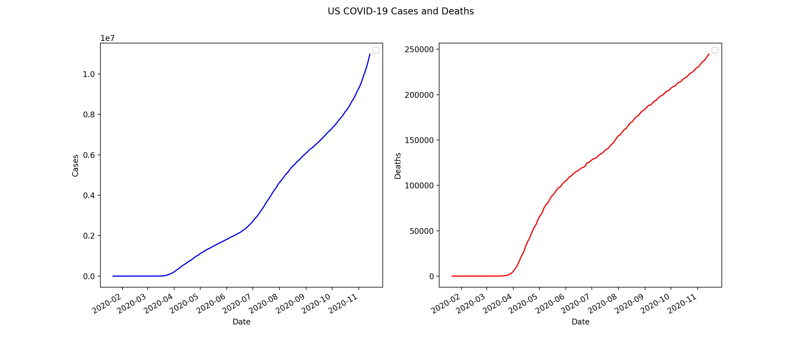
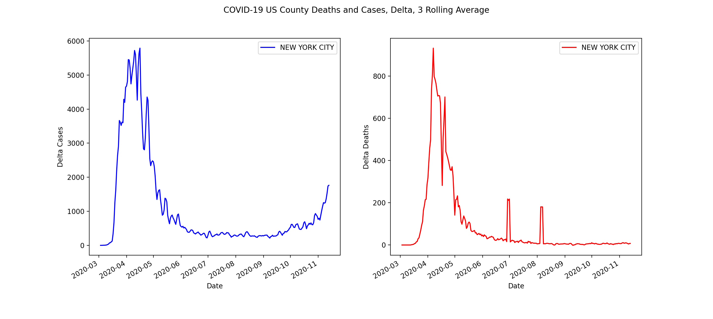
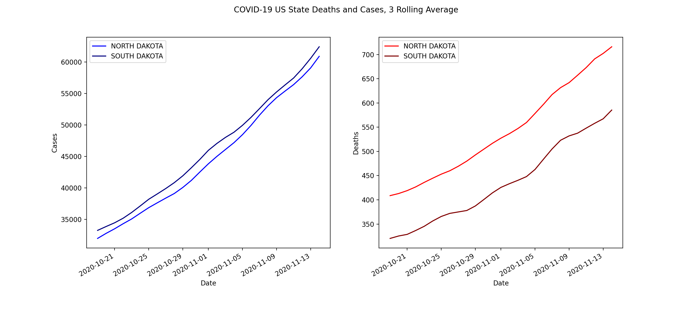
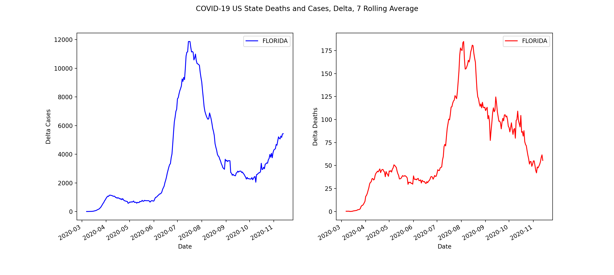
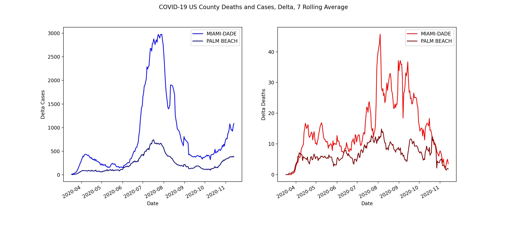

[](https://www.gnu.org/licenses/gpl-3.0-standalone.html)

# United States Covid Tracker

This python script provides a simple way to plot the number of cases and deaths
from COVID-19 in the United States. Statistics on COVID-19 data are pulled from
the [New York Times Github repository](https://github.com/nytimes/covid-19-data).

## Dependencies
1. [Numpy](https://numpy.org/)
2. [Pandas](https://pandas.pydata.org/)
3. [Matplotlib](https://matplotlib.org/)

## Usage

### Instantiation and Basics

The module contains the `CovidTracker` class, which handles all of the plotting
utilities. There cases and deaths can be plotted by the entire United States, by
state, and by county. To pull down the latest data and instantiate the
`CovidTracker` class, the `get_latest` class method can be used.

```python
from covidtracker import CovidTracker
ct = CovidTracker.get_latest()
```

The list of all states and all counties can be accessed by the `counties` and
`states` properties respectively. To search within this list of counties, the
`search_counties` and `search_states` methods can be used.


```python
from covidtracker import CovidTracker
ct = CovidTracker.get_latest()

# Get all counties
ct.counties

# Get all states
ct.states

ct.search_states('new')  #['NEW YORK', 'NEW HAMPSHIRE', 'NEW JERSEY', 'NEW MEXICO'] 

ct.search_counties('stone')  #['LIMESTONE', 'YELLOWSTONE', 'BIG STONE', 'STONE', 'PIPESTONE', 'FREESTONE', 'STONEWALL']
```

### Plotting

There are four methods which can be used for plotting. `plot_counties`,
`plot_states`, `plot_us`, and `plot`. The `plot` method can be used to
consecutively plot a combination of the counties, states, and the entire United
States. All four methods share similar parameters for plotting. 

#### Common Parameters

##### roll_avg_days: `int` (default None)
If provided, calculates the rolling average over the days.

##### delta: `int` (default False)
If True, will calculate the difference between each day. Works best when
combined with a rolling average.

##### days_back: `int` (default None) 
If provided, will only show up to the last amount of days on the plot. Is
calculated with `months_back`. If no argument is provided nor for `months_back`,
then the entire series is plotted.

#####  months_back: `int` (default None)
If provided, will only show up to the last amount of months on the plot. Is
calculated with `days_back`. If no argument is provided nor for `days_back`,
then the entire series is plotted.

-----

#### Parameters for `plot_counties` 
##### counties: `str` or `List[str]`
The county or list of counties to plot

-----

#### Parameters for `plot_states` 
##### states: `str` or `List[str]`
The states or list of states to plot

-----

#### Parameters for `plot` 
##### counties: `str` or `List[str]`
The county or list of counties to plot
##### states: `str` or `List[str]`
The states or list of states to plot
##### plot_us: `bool` (default False) 
If True, will plot the graph for the entire United States. If no counties or
states are provided, the entire United States will be plotted regardless

## Sample Code


```python
from covidtracker import CovidTracker
ct = CovidTracker.get_latest()

ct.plot_us()

ct.plot_counties('new york city', delta=True, roll_avg_days=3)

ct.plot_states(['north dakota', 'south dakota'], months_back=1, roll_avg_days=3)

ct.plot(counties=['miami-dade', 'palm beach'], states='florida', roll_avg_days=7, delta=True, plot_us=False)
```

## Sample Plots
All plots were taken from the above samples










